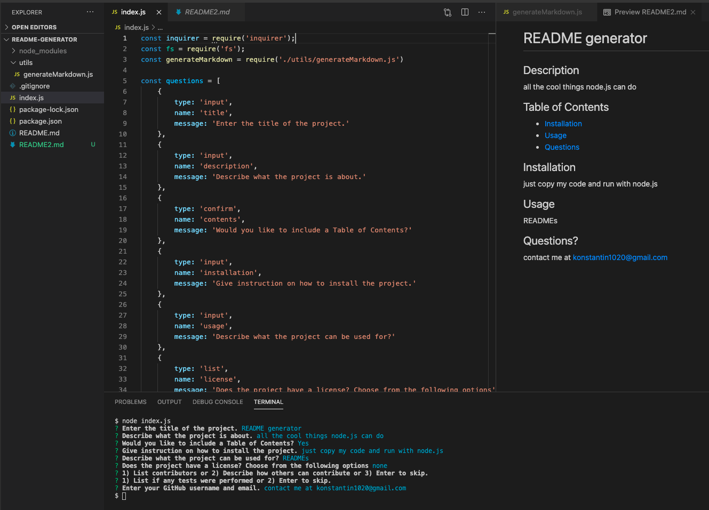

# README generator

  ## Description
  This app generates a high-quality README. This app is created for the purposes of simplifying the process of generating README files with markdown styling. It is also created, in part, to demonstate my ability to work with Node.js, Comman Line Interface, and JavaScript.   
## Table of Contents 
  * [Installation](#installation)
  * [Usage](#usage)
  * [Questions](#questions)
  ## Installation 
  Feel free to fork my code and run it with Node.js. Enter "node index.js" in Terminal and then simply answer the questions. 
  ## Usage 
  It is a great tool to quickly generate READMEs for GitHub or any other purpose. 
  ## Questions? 
  Contact me through: https://github.com/spclk

  Here's a link to my tutorial video:
  [Video](https://drive.google.com/file/d/1OGlcF3daCouqfrA2uCwdns0Gn7Q1qcv6/view)

  And here's a screenshot:
  

